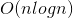
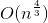

# DSAA(DataStructure And Algorithm)
:wrench: DSAA repo has various datastructure and algorithm implements using c++.
This repo not only has normal algorithm which in book. it's also has kinds of trick methods from OJ problem or math problem.

 

## Category

### DataStructure

|Name|Type|Difficult|
|----|----|---------|
|[LinkList](https://github.com/Geekya215/DSAA/blob/master/DataStructure/LinkList/LinkList.cpp)|Liner|:star:|
|[Stack]()|Liner|:star:|
|[Queue]()|Liner|:star:|
|[Fenwick_Tree](https://github.com/Geekya215/DSAA/blob/master/DataStructure/Tree/fenwick_tree.cpp)|Tree|:star::star:|
|[Segment_Tree](https://github.com/Geekya215/DSAA/blob/master/DataStructure/Tree/segment_tree.cpp)|Tree|:star::star::star:|
|[ZKW_Segment_Tree](https://github.com/Geekya215/DSAA/blob/master/DataStructure/Tree/zkw_tree.cpp)|Tree|:star::star::star:|
|[AVL_Tree](https://github.com/Geekya215/DSAA/blob/master/DataStructure/Tree/AVL_Tree.cpp)|Tree|:star::star:|
|[RB_Tree](https://github.com/Geekya215/DSAA/blob/master/DataStructure/Tree/RB_Tree.cpp)|Tree|:star::star::star:|
|[B+ Tree]()|Tree|:star::star::star:|
|[Trie]()|Tree|:star::star::star:|
|[Huffman_Tree]()|Tree|:star::star:|

### Algorithm
#### Sort
|Name|Stable|Best Time Complexity|Worst Time Complexity|Average Time Complexity|Sapce Complexity|
|----|:----:|:------------------:|:-------------------:|:---------------------:|:--------------:|
|[Bubble](https://github.com/Geekya215/DSAA/blob/master/Algorithm/Sort/bubble_sort.cpp)|✔️ |||||
|[Insert](https://github.com/Geekya215/DSAA/blob/master/Algorithm/Sort/insert_sort.cpp)|✔️ |||||
|[Select](https://github.com/Geekya215/DSAA/blob/master/Algorithm/Sort/select_sort.cpp)|❌ |||||
|[Shell](https://github.com/Geekya215/DSAA/blob/master/Algorithm/Sort/shell_sort.cpp) |❌ |||||
|[Quick](https://github.com/Geekya215/DSAA/blob/master/Algorithm/Sort/quick_sort.cpp) |⭕️ |||||
|[Heap](https://github.com/Geekya215/DSAA/blob/master/Algorithm/Sort/heap_sort.cpp)  |❌ |||||
|[Merge](https://github.com/Geekya215/DSAA/blob/master/Algorithm/Sort/merge_sort.cpp) |✔️ |||||

#### Math
|Name|Time Complexity|Difficult|
|----|:-------------:|:-------:|
|[GCD]()|||
|[LCM]()|||
|[Sieve of Eratosthenes]()|||
|[Sieve of Euler]()|||
|[Euler Function]()|||

#### Graph
|Name|TIme Complexity|Difficult|
|----|:-------------:|:-------:|
|[Dijkstra](https://github.com/Geekya215/DSAA/blob/master/Algorithm/Graph/dijkstra.cpp)|||
|[Bellman Ford](https://github.com/Geekya215/DSAA/blob/master/Algorithm/Graph/bellman_ford.cpp)|||
|[Warshall Floyd](https://github.com/Geekya215/DSAA/blob/master/Algorithm/Graph/floyd_warshall.cpp)|||

#### Search
|Name|Time Complexity|Difficult|
|----|:-------------:|:-------:|
|[DFS](https://github.com/Geekya215/DSAA/tree/master/Algorithm/Search/DFS)|||
|[BFS](https://github.com/Geekya215/DSAA/tree/master/Algorithm/Search/BFS)|||
|[Binary Search](https://github.com/Geekya215/DSAA/tree/master/Algorithm/Search/Binary_Search)|||

#### Other
- [Zeller Formula](https://github.com/Geekya215/DSAA/blob/master/Algorithm/Other/zeller_formula.cpp)
- [Fsst Pow](https://github.com/Geekya215/DSAA/blob/master/Algorithm/Other/fastpow.cpp)
- [Fibonacci Matrix](https://github.com/Geekya215/DSAA/blob/master/Algorithm/Other/fibonacci_matrix.cpp)
- [DanceLink](https://github.com/Geekya215/DSAA/blob/master/Algorithm/Other/dancelink.cpp)

